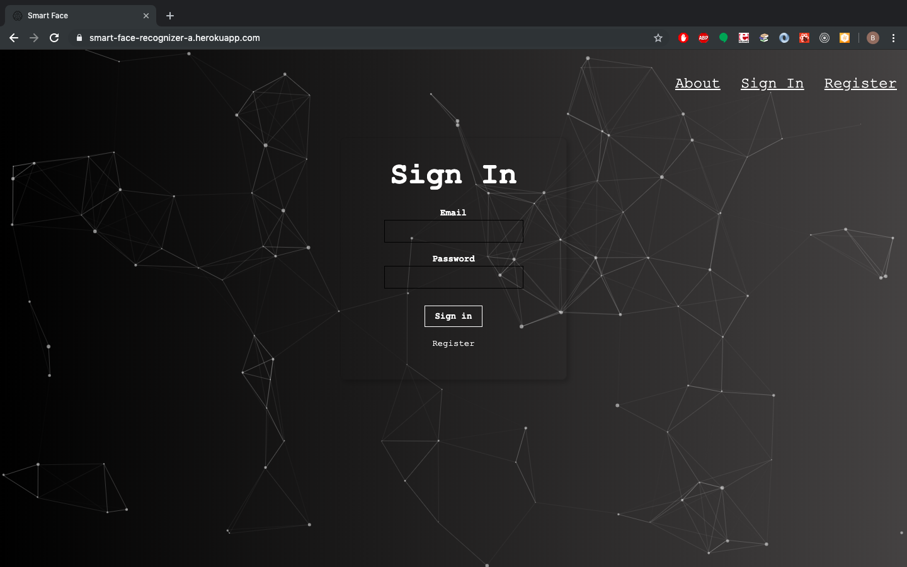
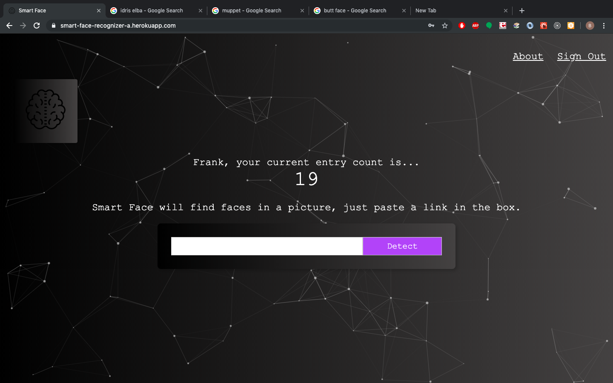
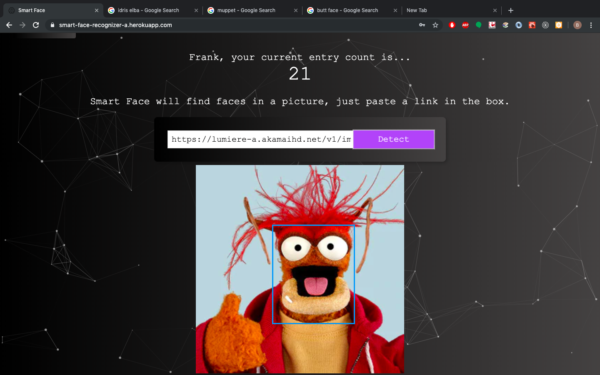

# Smart-Face-Back-End
> A small project that doesn't do that much!  (But what it does, it does pretty well.)

[Live Demo](https://smart-face-recognizer-a.herokuapp.com/)
>Heroku might need a minute to spin up a dyno so it will be slow at first :)

I made this app to showcase clean, simple react code,rock-solid authentication, API integration, a node/express server, and a small database.

Just sign in and paste a link to a photo in the box.  Smart Face will detect faces in it, and put a blue box around the face!  

## Screen Shots




# Interesting Edge Cases



## Installation

1. Fork and Clone down the repo
2. Create a local Postgres Database with whatever tool set you like.  It must have two 
tables, users and login. Here's some SQL queries you can run to make the tables we will need.
```
CREATE TABLE users (
    id serial PRIMARY KEY,
    name VARCHAR(100),
    email text UNIQUE NOT NULL,
    entries BIGINT DEFAULT 0,
    joined TIMESTAMP NOT NULL
);
```

```
CREATE TABLE login (
    id serial PRIMARY KEY,
    hash varchar(100) NOT NULL,
    email text UNIQUE NOT NULL
);
```

3. Once your Database is running, go to [clarafai.com](https://www.clarifai.com/) and get a free API Key

4. In the back-end project folder, make a file called .env and in it, define two enviornmental variables:

```
CLARIFAI_API_KEY = whateversYourApiKey

DATABASE_URL = localhost/nameOfYourDB
```

4. In a terminal, navigate to the root directory and run 

```
npm install 
```

5. Then run 

```
npm start 

```

6. Use [this Repo's](https://github.com/Ibenthinkin/Smart-Face-Front-End) ReadMe to install the front-end
## Meta

Ben Reilly –  benjamin.reilly@gmail.com

Distributed under the MIT license. See ``LICENSE`` for more information.

[https://github.com/Ibenthinkin/Smart-Face-Back-End](https://github.com/ibenthinkin/)

## Contributing

1. Fork it (<https://github.com/Ibenthinkin/Nous-Front-End/fork>)
2. Create your feature branch (`git checkout -b feature/fooBar`)
3. Commit your changes (`git commit -am 'Add some fooBar'`)
4. Push to the branch (`git push origin feature/fooBar`)
5. Create a new Pull Request
